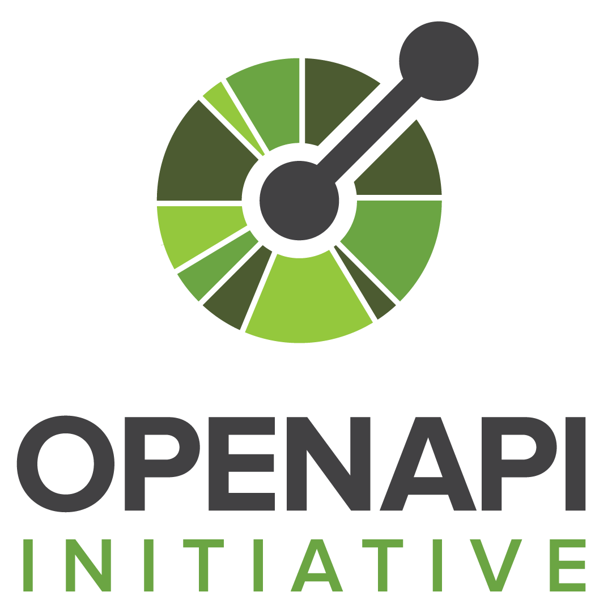

<p align="center"></p>

<h1 align="center">
    <strong>RESTful API with node.js</strong>
</h1>
<h3 align="center">
    RESTful API with node.js
</h3>

<h3 align="center">
  <a target="_blank" href="https://restfulapi.net/">restfulapi.net</a>
	<span> · </span>
  <a target="_blank" href="https://nodejs.org/en/">Node.js</a>
	<span> · </span>
  <a target="_blank" href="https://swagger.io/specification/">OpenAPI</a>
	<span> · </span>
  <a target="_blank" href="https://www.postman.com/">Postman</a>
	<span> · </span>
  <a target="_blank" href="https://insomnia.rest/">Insomnia</a>
</h3>
<br><br>

## Contents
- [Rest](#rest)
- [Node.js](#node.js)
- [OpenApi](#openapi)
- [Postman](#postman)
- [Insomnia](#insomnia)
- [Our API](#our-api)
- [Debugging](#debugging)
- [RESTful Methods Requests](#restful-methods-requests)
- [Endpoint](#endpoint)
- [HTTP Response Codes](#http-response-codes)


## REST
REST - REpresentation State Transfer

Representational state transfer (REST) is a software architectural style which uses a subset of HTTP. It is commonly used to create interactive applications that use Web services. A Web service that follows these guidelines is called RESTful. Such a Web service must provide its Web resources in a textual representation and allow them to be read and modified with a stateless protocol and a predefined set of operations. This approach allows interoperability between the computer systems on the Internet that provide these services. REST is an alternative to, for example, SOAP as way to access a Web service.


## Node.js
Link: https://nodejs.org/en/

Node. js is primarily used for non-blocking, event-driven servers,\ 
due to its single-threaded nature. It's used for traditional web sites\ 
and back-end API services, but was designed with real-time,\ 
push-based architectures in mind.



## OpenApi
Link: https://swagger.io/specification/ 

The OpenAPI Specification (OAS) defines a standard, language-agnostic interface to RESTful APIs\
which allows both humans and computers to discover and understand the capabilities of the service\ 
without access to source code, documentation, or through network traffic inspection.\
When properly defined, a consumer can understand and interact with the remote service\
with a minimal amount of implementation logic.

An OpenAPI definition can then be used by documentation generation tools to display the API,\
code generation tools to generate servers and clients in various programming languages,\
testing tools, and many other use cases.


## Postman
Link: https://www.postman.com/

Postman is a software development tool. It enables people to test calls to APIs.\
Postman users enter data. The data is sent to a special web server address.\ 
Typically, information is returned, which Postman presents to the user.


## Insomnia
Link: https://insomnia.rest/

Insomnia is a powerful REST API Client with cookie management,\ 
environment variables, code generation, and authentication for Mac,\ 
Windows, and Linux. Insomnia REST Client is a tool in the API Tools category of a tech stack.

## Our API
To write this API you need to have node.js installed.

To start a new project we type in Terminal
```
npm init -y
```

This will write to us 'package.json' and give context to install packages\
that we can use in node like 'express'
```
npm install express
```
It will add express dependencies in 'package.json' file.

We will add 'index.js' file to write our code in\
There we will declare a variable whitch represents our API\
It's value is an import of 'express' package, whitc itself is a function
```
const app = require('express')();
const PORT = 8080;

app.listen(
    PORT,
    () => console.log(`it's alive on http://localohst:${PORT}`)
)
```

To start API we'll write on terminal
```
node .
```

It will display
*it's alive on http://localohst:8080*

When we paste that url in our browser we get error message 'Cannot GET /'\
That is because we don't have any API endpoint set up yet\
but 'express' is still responding with error message

## Debugging 
Debugging an API in browser is not the best option\
To acces our API we could use\
1. curl on the command line\
2. we coud install VSCode 'REST Client' extension\
3. or use REST client like 'insominia' or 'postman'

## RESTful methods requests
When sending out REST API request we get response from server.\
Usually in JSON format.

REST vs. CRUD\
There are 4 main request methods('http' actions) used in REST - alternitives for CRUD (CREATE, READ, UPDATE, DELETE)

| CRUD | HTTP | REST |
|-|-|-|
| Create | POST | /api/movie |
| Read | GET | /api/movie/{id} |
| Update | PUT | /api/movie |
| Delete | DELETE | /api/movie/{id} |

Other CRUD calls are:

| Method | Description |
|-|-|
| GET | The GET method requests a representation of the specified resource. Requests using GET should only retrieve data |
| HEAD | The HEAD method asks for a response identical to that of a GET request, but without the response body |
| POST | The POST method is used to submit an entity to the specified resource, ofteen causing a change in state or side effects on the server |
| PUT | The PUT method replaces all current representations of the target resource with the request payload |
| DELETE | The DELETE method deletes the specified resource |
| CONNECT| The CONNECT method establishes a tunnel to the server identified by the target resource. |
| OPTIONS | The OPTIONS method is used to describe the communication options for the target resource. |
| TRACE | The TRACE method performs a message loop-back test along the path to the target resource. |
| PATCH | The PATCH method is used to apply partial modifications to a resource. |

## Endpoint
Adding endpoint to our API

If we would like to add GET endpoint to 'tshirt' URI\
we can do that by passing '/tshirt' as first argument
```
app.get('/tshirt');
```

That would automatically set our server to an endpoint\
**GET** http://localhost:8080/tshirt

Then our job would handle the request to it with callback function as second argument
```
app.get('/tshirt', (req, res) => {          // req - request(incoming data), res - response(data we send back)
    res.status(200).send({                  // response can have statuscode(200 - OK)
        thsirt: '👕',                       // we can send data paylode with response
        size: 'large'
    })
});
```
If we pass a JavaScript object as an argument with response\ 
well get that data back as JSON by default.

Let's go save the file and restart the server - Ctrl+C to stop server in VSCode

Now we add a POST request
```
app.post('/tshirt/:id', (req, res) =>{  // POST endpoint with dynamic url parameter
    const { id } = req.params;
    const { logo } = req.body;

    if (!logo){                         // Check if there is a logo
        res.status(418).send({
            message: 'We need a logo!'  // Error response
        })
    }

    res.send({                          // If logo exists
        tshirt: '👕 with your ${logo} and ID of ${id}',
    })

});   
```

In Insomnia we do POST request to tshirt, followed by unique id
```
http://localhost:8080/tshirt/23
```
In body section we'll add unique body in format of JSON\
as a JSON object with 'logo' with a string value
```
{
    "logo": "🔥"
}
```

If we send our request, we'll get 500 error response\
whitch means our API code is brocken because express can't\
parse JSON by default.

To solve that we need to set up a middleware(REQ -> MIDDLEWARE -> RESPONSE)\
that tells express to parse JSON before the actual data hits the function\
that we use to handle the request.

Very common middleware is built in express itself so we can refacture our code\
to make a variable for express and we can call 'app.use' to apply middleware.\
In our case we use 'express.json' middleware. Now every request that coms in\
goes thru that middleware that will convert the body to JSON.
```
const express = require('express');
const app = express();
const PORT = 8080;

app.use(express.json());
```

If we save now, restart our server, go back to Insomnia and send exact same request as earlier.\
We get successful response.\
If we send 'logo' with empty string, we get response that 'We need a logo!'

## HTTP Response Codes
HTTP defines these standard status codes that can be used to convey the results of a client’s request.\ 
The status codes are divided into the five categories.

* 1xx: Informational – Communicates transfer protocol-level information.
* 2xx: Success – Indicates that the client’s request was accepted successfully.
* 3xx: Redirection – Indicates that the client must take some additional action in order to complete their request.
* 4xx: Client Error – This category of error status codes points the finger at clients.
* 5xx: Server Error – The server takes responsibility for these error status codes.

200 - OK Indicates that request has succeeded.

https://en.wikipedia.org/wiki/List_of_HTTP_status_codes
